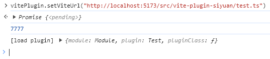

## 思源 vite 开发插件

> 此项目由 https://github.com/2234839/OceanPress_siyuan_plugin 自动生成

可通过此插件连接 vite 启动的本地服务

## 使用方法

在控制台执行 `vitePlugin.setViteUrl("http://localhost:5173/src/vite-plugin-siyuan/test.ts")` 其中 url 修改为本地 vite 启动的地址



test.ts 的代码如下

```ts
import { Plugin } from "siyuan";
// 插入此变量，vite 将会自动插入热更新代码
import.meta.hot;

export default class Test extends Plugin {
  onload(): void {
    console.log(7777);
  }
}
```

另外需要修改 vite.config.ts 添加如下插件

```ts
plugins: [
// siyuan lib 实际上是空的，在运行时才能够通过 require 进行加载，
// 而 vite 使用 import 会无法加载到改包，这里做一个 hack 给改成 require
// 这样配合 vite-plugin-siyuan 就可以在开发的时候直接引用了
{
name: "siyuan shim",
transform(code, id) {
    // 仅当代码包含 "siyuan" 包的 import 语句时进行处理
    if (/import \{(.*)\} from "siyuan"/.test(code)) {
    const transformedCode = code.replace(
        /import \{(.*)\} from "siyuan"/,
        'const {$1} = require("siyuan")',
    );
    return {
        code: transformedCode,
        map: null, // 可以提供 sourcemap
    };
    }
},
},
],
```
